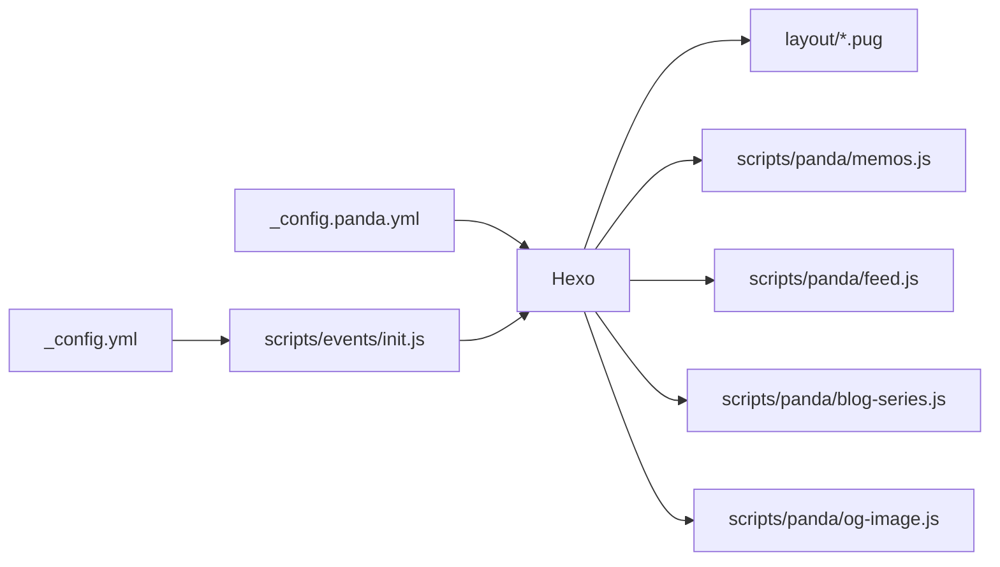

<div align="right"><a title="中文" href="README_CN.md">中文</a> | English</div>

<p align="center">
  
</p>

<h1 align="center">hexo-theme-panda</h1>

<p align="center">
  <a href="LICENSE"></a>
  <a href="https://www.npmjs.com/package/hexo-theme-panda"></a>
  <a href="https://www.npmjs.com/package/hexo-theme-panda"></a>
  <a href="https://hexo.io"></a>
  <a href="https://nodejs.org"></a>
  <a href="https://speechlesspanda.github.io"></a>
</p>

<p align="center">A card-style Hexo theme: memos timeline, blog series, gradient visuals, built-in Atom feed &amp; OG image generation</p>
<p align="center">Forked and extended from <a href="https://github.com/jerryc127/hexo-theme-butterfly">hexo-theme-butterfly</a> 5.7.0 (Apache-2.0)</p>
<p align="center"><strong>Demo</strong>: <a href="https://speechlesspanda.github.io">SpeechlessPanda's Blog</a> · <strong>npm</strong>: <a href="https://www.npmjs.com/package/hexo-theme-panda">hexo-theme-panda</a></p>

---

## ✨ What Panda adds on top of Butterfly

| Feature | Description | Default |
|---------|-------------|---------|
| Memos enhancements | Per-memo Giscus comment iframes, auto-expand commented memos, standalone deep-link pages, local-search injection | on |
| Home-as-about | Home renders `about/index.md`; the post stream moves to `/blog/` | on (optional) |
| Latest memo card | The newest memo pinned on top of the post stream | on |
| Blog series | A `_posts/<name>/` folder with `index.md` becomes one card on the post stream; chapters stay off the stream | on |
| Atom feed | Custom generator mixing posts + memos, with update-notification entries | on |
| OG share images | Per-post 1200×630 gradient images (requires `@resvg/resvg-js`) | off |
| Gradient look | Blue→purple→orange gradient header/footer/background (configurable, yields to your images) | on |
| Nav background band | With an image `background`, the fixed nav paints that image's top band, viewport-locked and aligned with `#web_bg` | on |
| Link target blank | Article/memo links open in a new tab | on |
| Extra highlighting | fish & typst grammars registered out of the box | built-in |
| `` collapse | Expanded blocks get a bottom collapse bar that scrolls back to the header | on |

Everything Butterfly offers (PJAX, dark mode, comment systems, search, word count, etc.) is kept intact and configured exactly the Butterfly way.

## 📦 Installation

### npm (recommended)

Hexo **≥ 5.3.0**. Run this in the Hexo **site** root (not inside the theme). Package: [hexo-theme-panda](https://www.npmjs.com/package/hexo-theme-panda).

```bash
npm install hexo-theme-panda hexo-renderer-pug hexo-renderer-stylus
```

Hexo 5+ loads `hexo-theme-panda` from `node_modules`. Do **not** copy it into `themes/`. Upgrade later:

```bash
npm update hexo-theme-panda
```

### Git clone

```bash
git clone https://github.com/SpeechlessPanda/hexo-theme-panda.git themes/panda
npm install hexo-renderer-pug hexo-renderer-stylus hexo-util moment-timezone
```

Enable the theme in the site `_config.yml`:

```yaml
theme: panda
```

New site from scratch:

```bash
npm install -g hexo-cli
hexo init my-blog && cd my-blog
npm install hexo-theme-panda hexo-renderer-pug hexo-renderer-stylus
```

Then set `theme: panda` as above.

## 🖥️ Daily commands

All of these run in the **site root**. Full CLI: [Hexo commands](https://hexo.io/docs/commands).

| Command | What it does |
|---------|----------------|
| `hexo new "My post"` | New article → `source/_posts/My-post.md` |
| `hexo new series "Intro to X"` | New series → `source/_posts/Intro to X/index.md` (title is the folder name, not slugized) |
| `hexo new --series "Intro to X" "Chapter 1"` | New chapter → `source/_posts/Intro to X/Chapter 1.md` (creates `index.md` if missing) |
| `hexo new page about` | New page → `source/about/index.md` |
| `hexo server` / `hexo s` | Local preview at http://localhost:4000/ |
| `hexo s --draft` | Preview including drafts |
| `hexo generate` / `hexo g` | Build static files into `public/` |
| `hexo deploy` / `hexo d` | Publish `public/` with your deployer |
| `hexo g -d` | Generate, then deploy |
| `hexo clean` | Delete `db.json` and `public/` |
| `hexo clean && hexo g -d` | Full republish |
| `hexo clean && hexo s` | Stale theme/config? wipe cache, then preview |

Memos (碎碎念) are **not** created with `hexo new`. Edit `source/_data/shuoshuo.yml`, then `hexo s` or `hexo g`.

### Deploy (publish the blog)

`hexo deploy` needs a deployer plugin. GitHub Pages example:

```bash
npm install hexo-deployer-git
```

```yaml
# site _config.yml
deploy:
  type: git
  repo: git@github.com:<user>/<user>.github.io.git
  branch: main
```

```bash
hexo clean && hexo g -d
```

Panda writes `public/atom.xml` itself. Do **not** also enable `hexo-generator-feed` (both would claim the same path).

## ⚙️ Configuration

Same convention as Butterfly: **don't edit** the packaged `_config.yml` (`node_modules/hexo-theme-panda/_config.yml` or `themes/panda/_config.yml`). Create `_config.panda.yml` in your site root and put your overrides there (Hexo deep-merges, overlay wins).

The fully-commented default config lives in [_config.yml](_config.yml).



## ✅ Requirements

- [Hexo](https://hexo.io/) **≥ 5.3.0** (8.x works; this is what the demo runs)
- Node.js **≥ 18**
- Renderers: `hexo-renderer-pug` and `hexo-renderer-stylus` (install them if your site does not already have them)

Optional extras, only if you turn the matching feature on:

| Feature | Extra install |
|---------|----------------|
| OG share images (`og_image.enable`) | `npm install @resvg/resvg-js` |
| Local search injection | Butterfly-style `search.use: local_search` plus a search data file |
| Memo comment counts | `GH_DISCUSSION_TOKEN` in the build environment |

## 🐼 Panda features

### Home-as-about

```yaml
# _config.panda.yml
home_about:
  enable: true            # falls back to the post list when the source page is missing
  source: about/index.md
```

Move the post stream to `/blog/` and bind the home page:

```yaml
# site _config.yml
index_generator:
  path: /blog
```

```markdown
---
title: About
layout: home
---
```

(source/index.md)

`/` keeps the full-screen hero (title + typewriter). `/blog/` uses the same short header as About / Links (`#page-site-info`, i18n `page.articles`), not the homepage banner.


### Memos (shuoshuo)

1. Create `source/memos/index.md`:

```markdown
---
title: Memos
type: shuoshuo
---
```

2. Write entries in `source/_data/shuoshuo.yml`:

```yaml
- date: 2026-09-10 12:00   # site timezone (_config.yml `timezone`)
  content: Supports **markdown** and [links](https://example.com)
  tags: [life]              # optional
  key: my-custom-key        # optional; derived from date otherwise
```

```yaml
# _config.panda.yml
memos:
  enable: true
  path: /memos/            # page path (shared by card link, standalone pages, feed)
  data_key: shuoshuo       # source/_data/<data_key>.yml
  latest_card: true        # "latest memo" card on the post stream
  standalone_pages: true   # one deep-linkable page per memo
  search_injection: true   # inject into local search (needs search.use: local_search)
  comment_count: true      # build-time Giscus counts -> auto-expand commented memos
```

Comments use Giscus (`comments.use: Giscus` + `giscus.*`, same as Butterfly). Each memo gets its own discussion via the theme's multi-iframe giscus `/widget` integration.

> `comment_count` needs `GH_DISCUSSION_TOKEN` (a GitHub token with discussions read access) in the build environment. Without it, the step is skipped silently and comment areas stay collapsed.

### Blog series

A series is a **one-level folder** under `source/_posts`, not Butterfly's `` tag (`series.enable` stays off).

| Path | Role |
|---|---|
| `source/_posts/hello.md` | Independent post, shown on the post stream |
| `source/_posts/Intro to X/index.md` | Series metadata only (`title` + `description` keys required; `description` may be empty). Not a post, not in the feed |
| `source/_posts/Intro to X/Chapter 1.md` | Chapter: listed on the series page, hidden from the post stream, still an RSS entry |

`index.md` example:

```markdown
---
title: Intro to X
description: From zero to a working setup
cover: /img/series-intro.jpg
---
```

`cover` is the series thumbnail (same idea as a post `cover`). It appears on the `/blog/` series card and as the series page header. It does **not** inherit from chapters.

| `cover` value | Effect |
|---|---|
| `/img/foo.jpg`, `https://…/foo.png` | Image. Local files go in `source/` so the URL matches (`source/img/foo.jpg` → `/img/foo.jpg`). Also `gif` / `svg` / `webp` / `avif` |
| `linear-gradient(135deg, #6ec6ff, #ffd2a8)` or `#6ec6ff` | CSS background, not an `` |
| empty / omit / `false` | No card image; series page header falls back to `default_top_img` |


The post stream mixes independent posts and series cards, newest first. A series card's date is its **latest chapter**. Empty series (index only) are omitted. Drag existing posts into the folder — no extra front-matter — and they leave the stream on the next `hexo g` / `hexo s`. CLI: `hexo new series "Intro to X"` and `hexo new --series "Intro to X" "Chapter 1"` (see [Daily commands](#-daily-commands)).

```yaml
# _config.panda.yml
blog_series:
  enable: true
  path: /series/    # landing page URL prefix
```

Landing pages: `/series/<folder>/`. Chapter permalinks stay whatever your site `permalink` already is. In-series prev/next only walks sibling chapters. Comments on the series page follow the site comment system; set `comments: false` on `index.md` to turn them off.

Deeper than one folder (`_posts/a/b/c.md`) is ignored.

### Atom feed

```yaml
# _config.panda.yml
feed:
  enable: true           # on by default; do not run hexo-generator-feed together
  path: atom.xml
  post_limit: 20
  excerpt_limit: 140
  update_notify_hours: 24  # re-push posts updated more than 24h after publish
  include_memos: true
```

Entry identity lives entirely in the URL path (never query/fragment), which every reader preserves; memo entries link to their standalone pages and update entries to auto-generated redirect stubs. Series chapters are ordinary posts in the feed; series `index.md` is not a post and never appears. A series card on the post stream is dated by its latest chapter, so a new chapter also moves the card.

### OG share images

```bash
npm install @resvg/resvg-js   # once, in your site
```

```yaml
# _config.panda.yml
og_image:
  enable: true
  width: 1200
  height: 630
```

The LXGW WenKai font (SIL OFL 1.1) is downloaded once into `fonts/` on first build. Each post gets `og-images/<slug>.png` wired into `og:image`.

### Gradient look

On by default. Setting Butterfly's `background`, `default_top_img` or `footer_img` makes the matching gradient area yield to your image automatically. To recolor:

```yaml
# _config.panda.yml
gradient:
  header_light: linear-gradient(135deg, ...)
  header_dark: linear-gradient(135deg, ...)
  web_bg_light: linear-gradient(180deg, ...)
  web_bg_dark: linear-gradient(180deg, ...)
  # plus header_mask_* / nav_* — see the default config comments
```

Disable entirely: `gradient.enable: false`.

### Website background & nav band

Butterfly's `background` paints the page background (`#web_bg`). Panda adds one thing on top: when that value is an **image**, the fixed nav bar paints the **top band of the same image**, locked to the viewport. It no longer scrolls away, and it no longer falls back to a flat gradient bar.

```yaml
# _config.panda.yml
background: /img/bg.webp        # an array works too — a random pick on each load
```

Why it lines up: `#web_bg` is a viewport-sized box with `background-size: cover` + `background-position: center`. The nav rule uses the same geometry with `background-attachment: fixed`, so its 60px window shows exactly the top strip of the rendered page background — same pixels, no seam, no scroll.

Legibility: the band carries a scrim (`gradient.nav_band_mask_light/dark`) under white / `#eaf4ff` nav text. Measured against a mid-tone photo: 5.0:1 in light mode, 5.2:1 in dark mode. Unusually light or dark image? Retune:

```yaml
# _config.panda.yml
nav:
  background_band: true      # false keeps the gradient nav bar
  band_text_light: '#ffffff'
  band_text_dark: '#eaf4ff'
gradient:
  nav_band_mask_light: 'linear-gradient(180deg, rgba(12, 24, 44, 0.6) 0%, rgba(12, 24, 44, 0.42) 100%)'
  nav_band_mask_dark: 'linear-gradient(180deg, rgba(0, 0, 0, 0.58) 0%, rgba(0, 0, 0, 0.42) 100%)'
```

Edge cases:

- A color or a raw CSS gradient in `background` has no "top band", so the nav keeps the normal gradient bar.
- A random-array `background` keeps the nav on the image `#web_bg` actually picked (synced at runtime, PJAX included).
- iOS Safari treats `background-attachment: fixed` as `scroll`, which would zoom the image into the 60px bar. There the theme drops the image and keeps the scrim + blur.

### Misc

```yaml
# _config.panda.yml
link_target_blank: true   # article/memo links open in a new tab (default on)
```

fish / typst code highlighting works out of the box.

`…` is Butterfly's tag. Panda adds a bottom collapse bar (i18n: en Collapse / zh-CN 收起 / zh-TW 收合 / ja 閉じる / ko 접기). Clicking it closes the block and scrolls back to the header under the fixed nav. Asset URLs carry `?v=<theme version>` so a patch like 1.1.1 busts cached `main.js` / `index.css`.

## 🔄 Migrating from Butterfly

1. Replace `themes/butterfly` with this theme (or swap the npm package) and set `theme: panda`
2. Rename `_config.butterfly.yml` to `_config.panda.yml`
3. Butterfly's legacy `_data/butterfly.yml` override is not supported (Panda warns on startup)
4. Every other config key is compatible

## 📄 License

[Apache-2.0](LICENSE). Panda is derived from [hexo-theme-butterfly](https://github.com/jerryc127/hexo-theme-butterfly) by Jerry (Apache-2.0); see [NOTICE](NOTICE) for attribution and the list of changes. Modified files carry a notice in their header comments. The OG font [LXGW WenKai](https://github.com/lxgw/LxgwWenKai) is SIL OFL 1.1.

Releases: [CHANGELOG.md](CHANGELOG.md).
