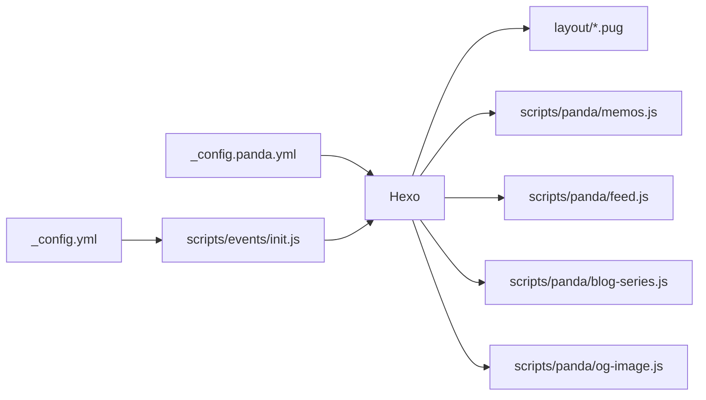

<div align="right">中文 | <a title="English" href="README.md">English</a></div>

<p align="center">
  
</p>

<h1 align="center">hexo-theme-panda</h1>

<p align="center">
  <a href="LICENSE"></a>
  <a href="https://www.npmjs.com/package/hexo-theme-panda"></a>
  <a href="https://www.npmjs.com/package/hexo-theme-panda"></a>
  <a href="https://hexo.io"></a>
  <a href="https://nodejs.org"></a>
  <a href="https://speechlesspanda.github.io"></a>
</p>

<p align="center">卡片式 Hexo 主题：碎碎念时间线、博客系列、渐变视觉、内置 Atom feed 与 OG 图生成</p>
<p align="center">基于 <a href="https://github.com/jerryc127/hexo-theme-butterfly">hexo-theme-butterfly</a> 5.7.0 二次开发（Apache-2.0）</p>
<p align="center"><strong>演示站点</strong>: <a href="https://speechlesspanda.github.io">SpeechlessPanda's Blog</a> · <strong>npm</strong>: <a href="https://www.npmjs.com/package/hexo-theme-panda">hexo-theme-panda</a></p>

---

## ✨ Panda 在 Butterfly 之上新增了什么

| 特性 | 说明 | 默认 |
|------|------|------|
| 碎碎念增强 | 每条碎碎念独立 Giscus 评论区（多 iframe 方案）、有评论自动展开、独立页面深链、本地搜索命中 | 开 |
| 首页即关于页 | 首页直接渲染 `about/index.md`，文章流移到 `/blog/` | 开（可关） |
| 最新碎碎念卡片 | 文章流顶部展示最新一条碎碎念 | 开 |
| 博客系列 | `_posts/<系列名>/` 加 `index.md` 在文章流显示一张系列卡片，章节不出现在文章流 | 开 |
| Atom feed | 自写生成器：文章+碎碎念混排，旧文更新可重新推送 | 开 |
| OG 分享图 | 每篇文章自动生成 1200×630 渐变分享图（需 `@resvg/resvg-js`） | 关 |
| 渐变外观 | 蓝→紫→橙渐变页头/页脚/背景（可配置颜色，设背景图自动让位） | 开 |
| 导航栏背景带 | `background` 是图片时，固定导航栏铺该图最上方那条带，锁视口、与 `#web_bg` 对齐 | 开 |
| 链接新标签 | 正文/碎碎念链接统一新标签页打开 | 开 |
| 代码高亮扩展 | 额外注册 fish、typst 语法高亮 | 内置 |
| `` 底部收起 | 展开后底部出现收起条，点一下滚回该块标题 | 开 |

Butterfly 原有的全部能力（PJAX、深色模式、多种评论、搜索、字数统计、看板娘等）原样保留，配置方式完全兼容 Butterfly 文档。

## 📦 安装

### 方式一：npm（推荐）

需要 Hexo **≥ 5.3.0**。在 Hexo **站点根目录**执行（不要进主题文件夹）。包地址：[hexo-theme-panda](https://www.npmjs.com/package/hexo-theme-panda)。

```bash
npm install hexo-theme-panda hexo-renderer-pug hexo-renderer-stylus
```

Hexo 5+ 从 `node_modules` 加载 `hexo-theme-panda`，**不要**再拷进 `themes/`。以后升级：

```bash
npm update hexo-theme-panda
```

### 方式二：Git clone

```bash
git clone https://github.com/SpeechlessPanda/hexo-theme-panda.git themes/panda
npm install hexo-renderer-pug hexo-renderer-stylus hexo-util moment-timezone
```

然后改站点 `_config.yml`：

```yaml
theme: panda
```

从零建站：

```bash
npm install -g hexo-cli
hexo init my-blog && cd my-blog
npm install hexo-theme-panda hexo-renderer-pug hexo-renderer-stylus
```

再设置 `theme: panda`。

## 🖥️ 日常命令

全部在**站点根目录**执行。完整列表见 [Hexo 指令](https://hexo.io/zh-cn/docs/commands)。

| 命令 | 作用 |
|------|------|
| `hexo new "第一篇文章"` | 新建文章 → `source/_posts/第一篇文章.md` |
| `hexo new series "大学道路入门"` | 新建系列 → `source/_posts/大学道路入门/index.md`（文件夹用原标题，不 slugize） |
| `hexo new --series "大学道路入门" "第一章"` | 在系列里新建章节 → `source/_posts/大学道路入门/第一章.md`（没有 `index.md` 会补一份） |
| `hexo new page about` | 新建页面 → `source/about/index.md` |
| `hexo server` / `hexo s` | 本地预览 http://localhost:4000/ |
| `hexo s --draft` | 预览时包含草稿 |
| `hexo generate` / `hexo g` | 生成静态文件到 `public/` |
| `hexo deploy` / `hexo d` | 按站点 `deploy` 配置发布 `public/` |
| `hexo g -d` | 先生成再发布 |
| `hexo clean` | 删除 `db.json` 和 `public/` |
| `hexo clean && hexo g -d` | 全量重新发布博客 |
| `hexo clean && hexo s` | 改主题/配置后页面还是旧的：清缓存再预览 |

碎碎念**不是**用 `hexo new` 建的。改 `source/_data/shuoshuo.yml`，再 `hexo s` 或 `hexo g`。

### 发布博客

`hexo deploy` 需要部署插件。GitHub Pages 示例：

```bash
npm install hexo-deployer-git
```

```yaml
# 站点 _config.yml
deploy:
  type: git
  repo: git@github.com:<user>/<user>.github.io.git
  branch: main
```

```bash
hexo clean && hexo g -d
```

Panda 自己写 `public/atom.xml`。**不要**同时启用 `hexo-generator-feed`（会抢同一个路径）。

## ⚙️ 配置方式

与 Butterfly 完全一致：**不要改**包装里的 `_config.yml`（`node_modules/hexo-theme-panda/_config.yml` 或 `themes/panda/_config.yml`），在站点根目录新建 `_config.panda.yml`，把要改的键写进去即可（Hexo 深合并，覆盖文件优先）。

```yaml
# _config.panda.yml
menu:
  首页: / || fas fa-home
  归档: /archives/ || fas fa-archive
  碎碎念: /memos/ || fas fa-comment-dots
```

主题完整默认配置见 [themes/panda/_config.yml](_config.yml)，每个键都有注释。



## ✅ 环境要求

- [Hexo](https://hexo.io/) **≥ 5.3.0**（演示站跑的是 8.x）
- Node.js **≥ 18**
- 渲染器：`hexo-renderer-pug`、`hexo-renderer-stylus`（站点里没有的话需要装）

按需额外安装：

| 功能 | 额外依赖 |
|------|----------|
| OG 分享图（`og_image.enable`） | `npm install @resvg/resvg-js` |
| 碎碎念注入本地搜索 | Butterfly 同款 `search.use: local_search` + 搜索数据文件 |
| 碎碎念评论计数 | 构建环境提供 `GH_DISCUSSION_TOKEN` |

## 🐼 Panda 功能配置

### 首页即关于页

```yaml
# _config.panda.yml
home_about:
  enable: true            # 默认开；找不到来源页时自动回退为文章列表
  source: about/index.md  # 渲染哪个页面
```

配合使用：站点 `_config.yml` 把文章流挪到 `/blog/`，并创建 `source/index.md`：

```yaml
# 站点 _config.yml
index_generator:
  path: /blog
```

```markdown
---
title: 关于
layout: home
---
```

`/` 仍是全屏封面（站名 + 打字机）。`/blog/` 和关于、友链一样走矮页头（`#page-site-info`，文案用 i18n `page.articles`），不再套首页那套全屏渐变。


### 碎碎念（memos）

1. 创建页面 `source/memos/index.md`：

```markdown
---
title: 碎碎念
type: shuoshuo
---
```

2. 数据写入 `source/_data/shuoshuo.yml`：

```yaml
- date: 2026-09-10 12:00   # 站点时区（_config.yml 的 timezone）
  content: 支持 **markdown** 和 [链接](https://example.com)
  tags: [生活]              # 可选
  key: my-custom-key        # 可选；不写则按日期生成
```

```yaml
# _config.panda.yml
memos:
  enable: true
  path: /memos/            # 页面路径（最新卡片、独立页、feed 共用）
  data_key: shuoshuo       # source/_data/<data_key>.yml
  latest_card: true        # 文章流顶部「最新碎碎念」卡片
  standalone_pages: true   # 每条生成 /memos/<时间戳>/ 独立页（深链）
  search_injection: true   # 注入本地搜索（需 search.use: local_search）
  comment_count: true      # 构建时查 Giscus 评论数，有评论的自动展开
```

评论基于 Giscus（`comments.use: Giscus` + `giscus.*`，与 Butterfly 相同）。每条碎碎念一个独立 discussion，嵌入方式是主题自带的 giscus `/widget` 多 iframe 方案，同页多条互不影响。

> `comment_count` 需要构建环境提供 `GH_DISCUSSION_TOKEN`（GitHub token，discussions 读权限）。没有 token 时静默跳过，评论区保持默认折叠。

### 博客系列

系列是 `source/_posts` 下一层文件夹，**不是** Butterfly 的 `` 标签（`series.enable` 仍然默认关）。

| 路径 | 角色 |
|---|---|
| `source/_posts/hello.md` | 独立文章，出现在文章流 |
| `source/_posts/大学道路入门/index.md` | 只存系列元信息（必须有 `title`、`description` 两个键，`description` 可以空）。不是文章，不进 feed |
| `source/_posts/大学道路入门/第一章.md` | 章节：出现在系列页，不出现在文章流，但仍是 RSS 条目 |

`index.md` 示例：

```markdown
---
title: 大学道路入门
description: 从零到能跑起来
cover: /img/series-intro.jpg
---
```

`cover` 是系列封面（和文章的 `cover` 同一套）。会出现在 `/blog/` 的系列卡片上，也用作系列页页头背景。**不会**从章节继承。

| `cover` 填什么 | 效果 |
|---|---|
| `/img/foo.jpg`、`https://…/foo.png` | 图片。本地文件放 `source/`，URL 与路径对应（`source/img/foo.jpg` → `/img/foo.jpg`）。也支持 `gif` / `svg` / `webp` / `avif` |
| `linear-gradient(135deg, #6ec6ff, #ffd2a8)` 或 `#6ec6ff` | CSS 背景，不是 `` |
| 留空 / 不写 / `false` | 卡片无图；系列页页头回退到 `default_top_img` |


文章流按独立文章和系列卡片混排，新的在上。系列卡片的时间取**最新一章**。只有 `index.md`、还没有章节的空系列不出现。把已发表的文章拖进文件夹即可（不用改 front-matter），下次 `hexo g` / `hexo s` 就会从文章流消失。命令行：`hexo new series "大学道路入门"`、`hexo new --series "大学道路入门" "第一章"`（见[日常命令](#-日常命令)）。

```yaml
# _config.panda.yml
blog_series:
  enable: true
  path: /series/    # 系列落地页 URL 前缀
```

落地页：`/series/<文件夹>/`。章节 permalink 仍走站点原来的 `permalink`。文章里的上一篇/下一篇只在同一系列的章节之间跳。系列页评论跟站点评论系统走；在 `index.md` 写 `comments: false` 可关掉。

再深一层（`_posts/a/b/c.md`）会被忽略。


### Atom feed

```yaml
# _config.panda.yml
feed:
  enable: true           # 默认开；不要同时装 hexo-generator-feed
  path: atom.xml
  post_limit: 20
  excerpt_limit: 140
  update_notify_hours: 24  # 旧文更新超过 24h 换新 id 重新推送
  include_memos: true
```

条目身份标识全部放在 URL 路径里（不用 query/fragment），兼容所有阅读器；碎碎念条目链接指向独立页，旧文更新条目指向自动生成的跳转 stub 页。系列章节是普通文章，会出现在 feed 里；系列 `index.md` 不是文章、不进 feed。文章流上系列卡片的时间取最新一章，所以新章节也会把卡片顶上去。

### OG 分享图

```bash
npm install @resvg/resvg-js   # 站点里装一次
```

```yaml
# _config.panda.yml
og_image:
  enable: true
  width: 1200
  height: 630
```

首次构建自动下载 LXGW WenKai 字体（OFL 协议）到站点 `fonts/` 缓存。每篇文章生成 `og-images/<slug>.png` 并注入 `og:image`。

### 渐变外观

默认开启。设置 Butterfly 原有的 `background`（背景图）、`default_top_img`（页头图）、`footer_img` 时，对应区域的渐变**自动让位**给图片，无需手动关渐变。改颜色：

```yaml
# _config.panda.yml
gradient:
  header_light: linear-gradient(135deg, ...)   # 页头/页脚（浅色）
  header_dark: linear-gradient(135deg, ...)    # 页头/页脚（深色）
  web_bg_light: linear-gradient(180deg, ...)   # 页面背景（浅色）
  web_bg_dark: linear-gradient(180deg, ...)    # 页面背景（深色）
  # 还有 header_mask_* / nav_*，见默认配置注释
```

整体关闭：`gradient.enable: false`。

### 网页背景与导航栏背景带

Butterfly 的 `background` 负责铺页面背景（`#web_bg`）。Panda 在此之上补了一条：当它是**图片**时，固定导航栏直接铺**同一张图最上方那条带**，锁在视口上——不再随滚动跑掉，也不再退化成一块纯色/渐变条。

```yaml
# _config.panda.yml
background: /img/bg.webp        # 也支持数组：每次加载随机选一张
```

为什么能对齐：`#web_bg` 本身就是视口大小的盒子，`background-size: cover` + `background-position: center`；导航栏规则用同样的几何参数再加 `background-attachment: fixed`，于是它那 60px 窗口拿到的正是页面背景渲染结果的顶部一条——同一批像素，没有接缝，也不随滚动移动。

可读性：图片带上叠了一层遮罩（`gradient.nav_band_mask_light/dark`），配白色 / `#eaf4ff` 导航文字。以一张中间调照片实测：浅色模式 5.0:1，深色模式 5.2:1。图片特别亮或特别暗时自己调：

```yaml
# _config.panda.yml
nav:
  background_band: true      # 设 false 恢复原来的渐变导航栏
  band_text_light: '#ffffff'
  band_text_dark: '#eaf4ff'
gradient:
  nav_band_mask_light: 'linear-gradient(180deg, rgba(12, 24, 44, 0.6) 0%, rgba(12, 24, 44, 0.42) 100%)'
  nav_band_mask_dark: 'linear-gradient(180deg, rgba(0, 0, 0, 0.58) 0%, rgba(0, 0, 0, 0.42) 100%)'
```

边界情况：

- `background` 是颜色或原生 CSS 渐变时没有"最上方那条带"可言，导航栏保持原来的渐变样式。
- 随机数组背景会在运行时把导航栏同步到 `#web_bg` 真正选中的那张图（PJAX 切换同样同步）。
- iOS Safari 把 `background-attachment: fixed` 当 `scroll` 处理，会把图硬塞进 60px 条里；这类设备上去掉图片、保留遮罩和模糊。

### 其他

```yaml
# _config.panda.yml
link_target_blank: true   # 正文/碎碎念链接新标签页打开（默认开）
```

fish / typst 代码高亮开箱即用，无需配置。

`…` 是 Butterfly 原有标签。Panda 给展开态加了底部收起条（中文「收起」/ 台湾「收合」/ 英文 Collapse）。点击后收起并滚回该块标题（避开固定导航）。静态资源 URL 带 `?v=<主题版本>`，1.1.1 这类补丁会强制刷新缓存里的 `main.js` / `index.css`。

## 🔄 从 Butterfly 迁移

1. `themes/butterfly` 换成本主题（或 npm 包互换），站点 `_config.yml` 改 `theme: panda`
2. 站点根 `_config.butterfly.yml` 重命名为 `_config.panda.yml`
3. Butterfly 的 `_data/butterfly.yml` 旧式配置不再支持（Panda 会在启动时报错提示）
4. 其余配置键全部兼容

## 📄 协议

[Apache-2.0](LICENSE)。Panda 基于 [hexo-theme-butterfly](https://github.com/jerryc127/hexo-theme-butterfly)（作者 Jerry，Apache-2.0）二次开发，署名与修改说明见 [NOTICE](NOTICE)；被修改的文件头部均有修改声明。字体内嵌下载使用 [LXGW WenKai](https://github.com/lxgw/LxgwWenKai)（SIL OFL 1.1）。

版本记录：[CHANGELOG.md](CHANGELOG.md)。
